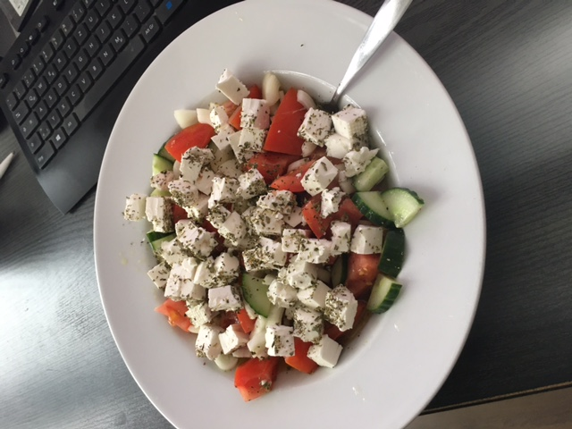

# Griechischer Bauernsalat

Super einfach zuzubereiten und super lecker! 

## Zutaten
- 1 Salatgurke
- 2 Paprikaschoten, rot und grün
- 500 g Tomaten
- 2 rote (!) Zwiebeln
- 200g Schafskäse
- 1 Glas Oliven, schwarze, ca. 100 g
- Salz und Pfeffer
- Saft von 1 Zitrone
- 125 ml Olivenöl
- Oregano

## Zubereitung
Gurke waschen und ungeschält in dünne Scheiben oder Stücke schneiden. Paprika waschen, entkernen und in dünne Streifen schneiden. Tomaten waschen und achteln. Zwiebeln schälen und in feine Ringe schneiden. Schafskäse würfeln und mit Oregano bestreuen. Oliven abgießen und mit Gurke, Paprika, Tomaten, Zwiebeln und Schafskäse in eine Schüssel geben. Olivenöl, Zitronensaft, Salz und Pfeffer zu einer Sauce verrühren und über den Salat gießen. Umrühren.
