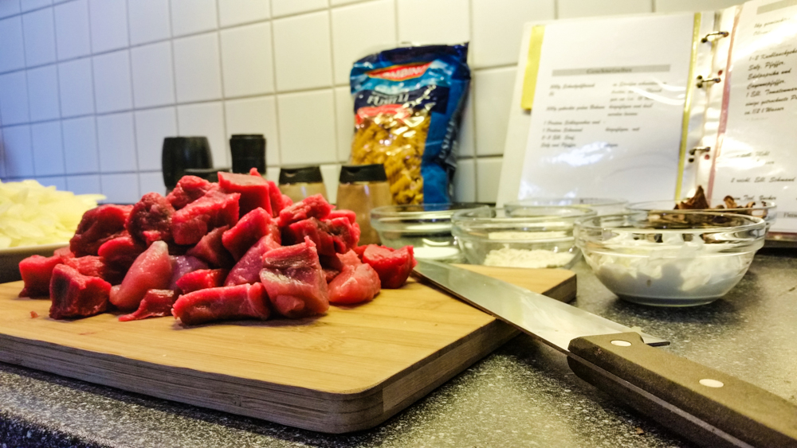
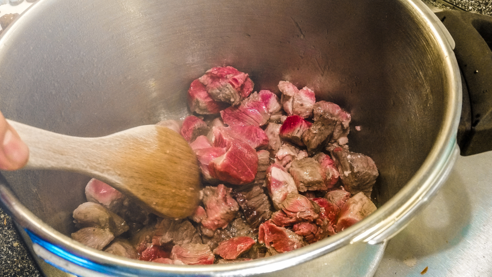
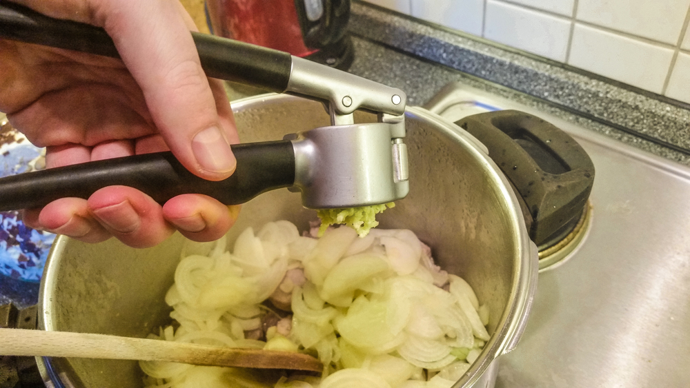
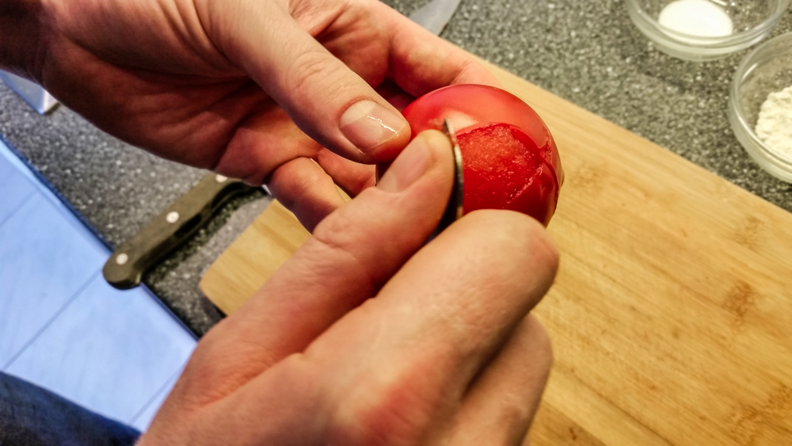
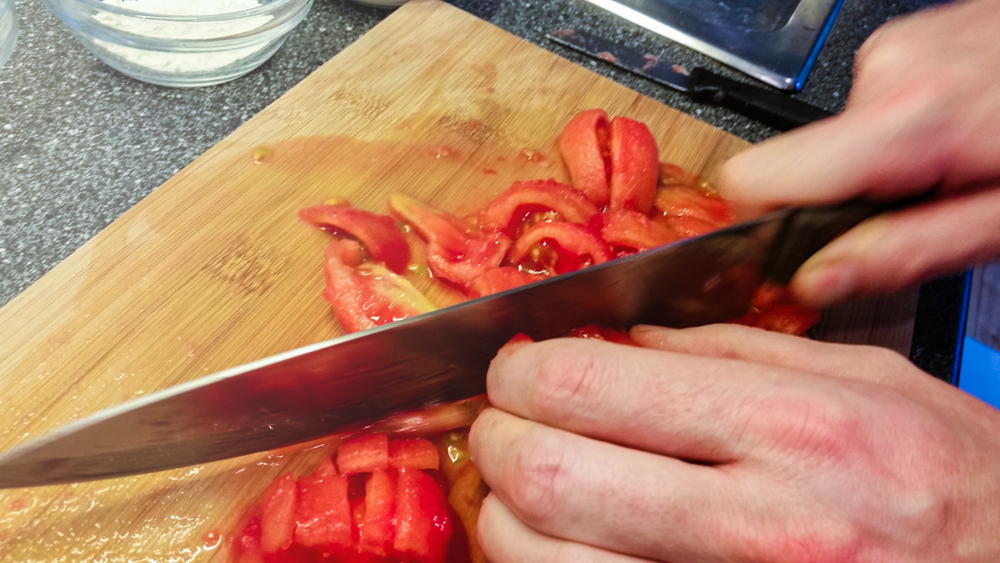
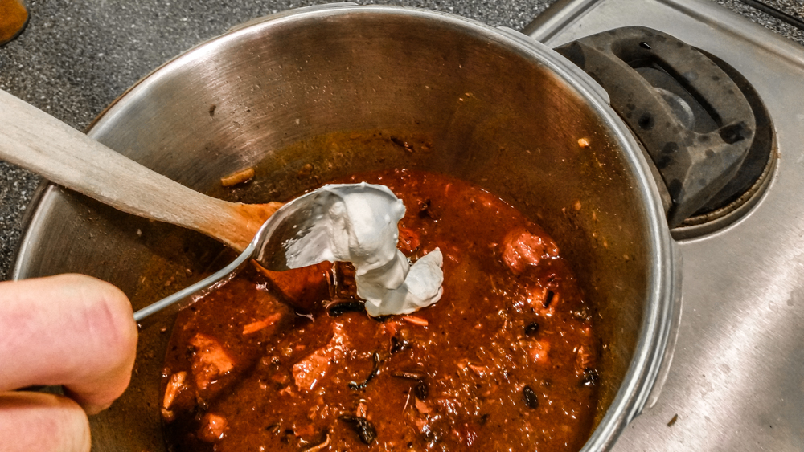
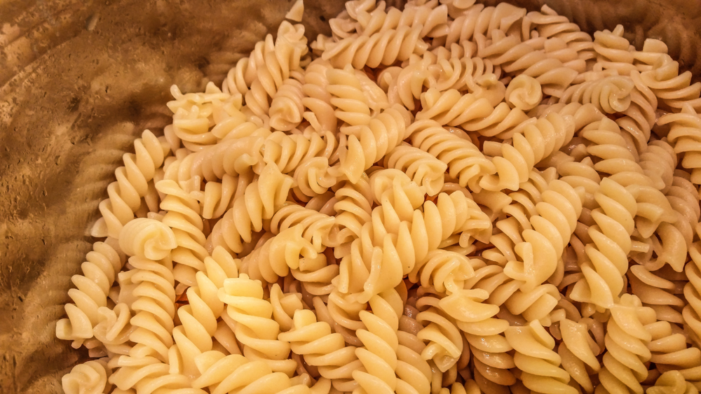
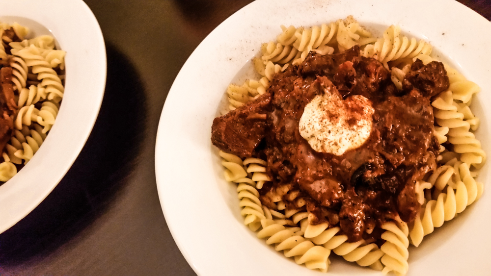

# **Gulasch**

## Gulasch wie bei Muttern

**Einkaufsliste für Gulasch**

* 1 kg Gulasch aus Schweine- und Rindfleisch

* 500 g Zwiebeln

* 1-2 Zehen Knoblauch
  
* 3 Stück Tomaten

* ½ Tasse getrocknete Mischpilze
  
* 1 EL Tomatenmark

* ½ l Gemüsebrühe
  
* 3 EL Olivenöl
  
* Salz nach Geschmack für das Nudelwasser und das Gulasch

* 2 gehäufte EL Paprika edelsüß
  
* 1 TL Pfeffer, schwarz, frisch gemahlen
  
* ½ TL Cayennepfeffer

* 1 TL Zucker 
  
* 1 EL Mehl
  
* 2-3 EL Schmand oder Saure Sahne
  
* 500 g Nudeln, z.B. Fusili

### Zubereitung

Die Zwiebeln schälen, halbieren und in Scheiben schneiden.

Die Knoblauchzehen schälen.

Das Olivenöl in einem großen Topf erhitzen und das Fleisch darin scharf anbraten. Wenn es schon etwas gebräunt ist, werden die Zwiebelscheiben zugegeben und der Knoblauch mit einer Knoblauchpresse zerdrückt und auch in den Topf gegeben.

 

Währenddessen werden die Tomaten unten kreuzförmig eingeritzt und für ca. 1 Minute in kochendes Wasser gelegt. Danach werden die Tomaten unter fliessendem, kalten Wasser abgeschreckt und können nun leicht geschält werden. Nun werden die gehäuteten Tomaten in kleine Würfel geschnitten.

 

Das Bratgut wird nun mit dem Mehl bestäubt und das Mehl kurz angeschwitzt. Dabei gibt man das Mehl am Besten durch ein Sieb, damit sich keine Klümpchen bilden können. Nach einer Minute wird das ganze mit der Brühe abgelöscht. Jetzt müssen das Tomatenmark, die Tomatenwürfel und die getrockenten Pilze zugegeben werden. Dann wird noch mit Salz, Pfeffer, Paprika, Cayennepfeffer und dem Zucker gewürzt.

Jetzt lässt man das Gulasch bei geschlossenem Deckel ca. 45 Minuten auf kleiner Flamme schmoren, bis das Fleisch schön zart ist. Eventuell muss Flüssigkeit durch Zugabe von etwas Brühe ergänzt werden. Bei Kochen mit einem Schnellkochtopf wird der Topf verschlossen und ca. 20 Minuten unter Druck auf kleinster Flamme kochen gelassen.

Währenddessen kann man jetzt in einem zweiten großen Topf etwa 2 Liter Wasser, mit 1 Teelöffel Salz und 1 Esslöffel Olivenöl für die Nudeln aufsetzen. Wenn das Wasser kocht, gibt man die Nudeln hinein und lässt sie unter gelegentlichem Umrühren auf niedriger Flamme kochen, bis sie die gewünschte Festigkeit erreicht haben. Für „Al-dente“ sind das ca. 10 Minuten, je nach Nudelart.

Wenn die Nudeln fertig sind, werden sie über der Spüle abgegossen und mit warmen Wasser abgeschreckt.
Jetzt sollte aber auch langsam das Gulasch fertig sein. Zum Schluß kommt der Schmand dazu und das ganze kann noch nach eigenem Geschmack abgeschmeckt werden.

Viel Spaß beim Nachkochen und einen guten Appetit!

### Rezept und Bilder von Oliver Mohn
