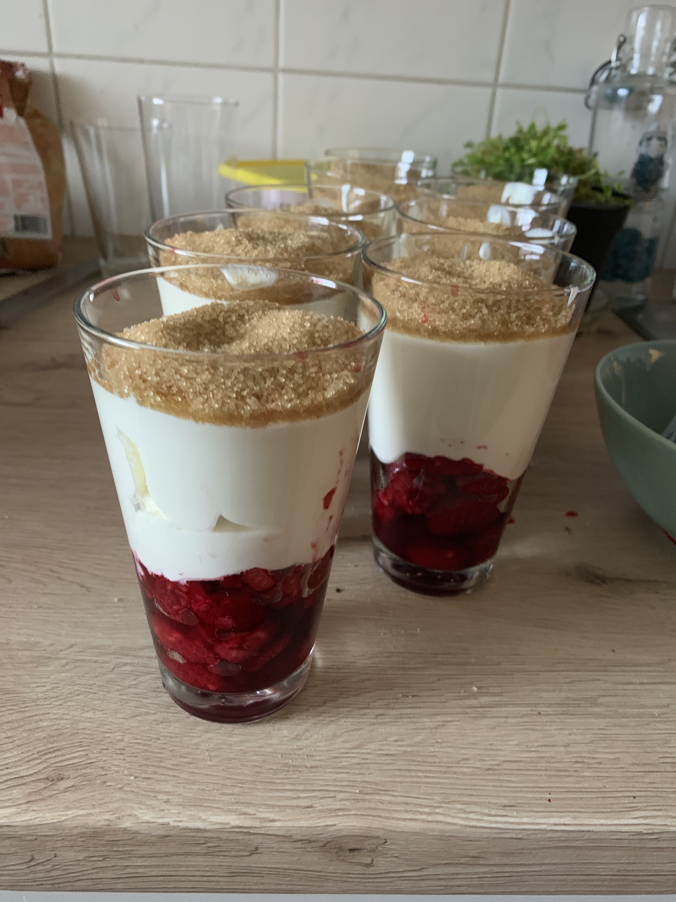

# Himbeertraum

Ein super kalorienreicher und schnell gemachter Nachtisch, den man am besten am Vortag zubereitet und über Nacht im Kühlschrank lagert, um den perfekten Geschmack zu erzielen. 

## Zutaten:
- brauner Zucker
- 400 g Sahne
- 400 g Mascarpone 
- 500 g Himbeeren 

## Zubereitung:
1. Himbeeren, falls tiefgefroren, auftauen lassen
2. Sahne schlagen 
3. Sahne mit Mascarpone vermengen 
4. Himbeeren in ein Glas geben
5. Mascarpone/Sahnecreme hinzugeben
6. Viel braunen Zucker aufs Glas geben 

Den Himbeertraum in den Kühlschrank geben und idealerweise 24 h im Kühlschrank lagern (es reichen aber auch einige Stunden), denn dann zieht der Zucker durch den Nachtisch und wird zusätzlich schön fest und knackig.

Hier noch ein Bild, denn Menschen mögen Bilder.

