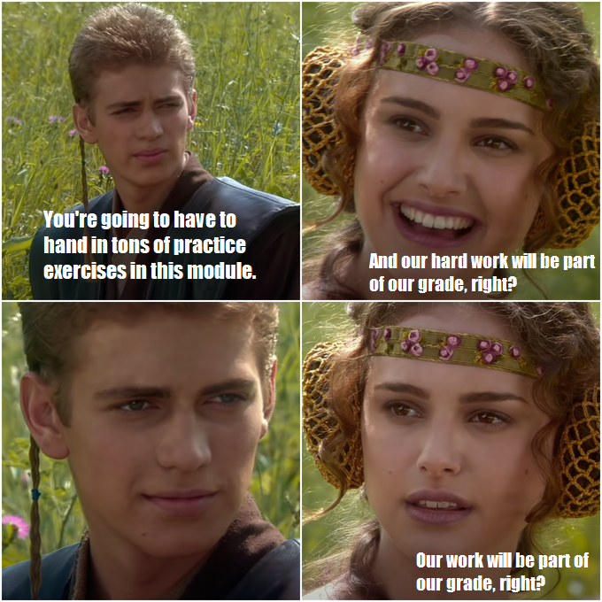

I am also trying this comment thing!

education
=========

I always learnt the most when I have a good script and practice-oriented exercises to guide me through my semester.

Having the opportunity to work through the exercises with our own passion projects also REALLY helped the process! 
It's fun and I learnt a ton. 

I think having (time-intensive) exercises count towards your grade is a very motivating factor and also helps keeping the exam-panic at bay! (Because you know you worked your way through the script and because you were already able to collect points for your grade.)

I am very happy about this course and I like memes, so I made a current one about other modules where all your work during the semester counts for nothing (in terms of grading) and only that last exam decides everything (and that is ... just not that nice).

