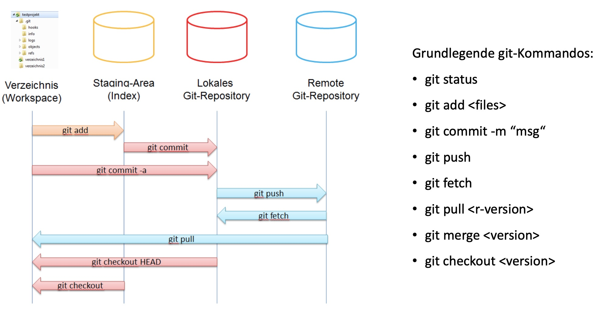

# BASICS


### Git-Repository anlegen
> Repository in bestehendem Verzeichnis einrichten
>  ```css
> $ git init
> ```

### Existierendes Repository klonen
> lädt jede Version von jeder Datei der Projekt-> >Historie
>
> ```css  
>git clone [url]
>
> // geklontes Verzeichnis eigenen Namen geben
>$ git clone https://github.com/libgit2/libgit2 >mylibgit // <-- mylibgit = eigener Name
>```
> >

 ### Zustand von Dateien prüfen  
> ```css
> git status
> ```
>
> **Kurzform**
> ?? = Datei nicht versioniert
> A = neue Dateien (die der Staging-Area hinzugefügt wurden)
> M = geänderte Dateien
> ```css
> // Kurzform
> git status --short
> -----------------------------------------------------------------------
> $ git status -s
> M README
> MM Rakefile
> A  lib/git.rb
> M  lib/simplegit.rb
> ?? LICENSE.txt
> ```


### Anzeigen von Änderungen (detailliert)
> zeigt genau die hinzugefügten und entfernten Zeilen (git status zeigt nur geänderte Datei an)
> * zeigt nicht alle Änderungen seit Ihrem letzten Commit an – nur die Änderungen, die noch „unstaged“ sind
>```css
> git diff
>```


### Stagen – Neue Dateien zur Versionsverwaltung hinzufügen
> neue Dateien zur Versionsverwaltung hinzuzufügen
> (bestimmten Inhalt für den nächsten Commit vormerken)
> * wenn Änderungen an File vorgenommen wurden, werden diese rot angezeigt
> 	--> mittels git add <filename> lässt sich Datei dann für commit vormerken
> * Git merkt sich eine Datei  für den Commit in exakt dem Zustand, in dem sie sich befindet, wenn Befehl git add ausgeführt wurde
>
> ```css
> git add <file>
>
> ```
### git ignore
> * ziemlich umfassende Liste guter .gitignore Beispiel-Dateien für Dutzende von Projekten und Sprachen auf https://github.com/github/gitignore
>

### Comitten
> * Commit zeichnet Snapshot auf, der in Staging-Area eingerichtet wurde (und nur den)
> * Alles, was nicht zum Commit vorgemerkt wurde, liegt immer noch als modifiziert da.
> *  Sie können einen weiteren Commit durchführen, um es zu Ihrer Historie hinzuzufügen. Jedes Mal, wenn Sie einen Commit ausführen, zeichnen Sie einen Schnappschuss Ihres Projekts auf, auf den Sie zurückgreifen oder mit einem späteren Zeitpunkt vergleichen können.
> ```css
> git commit
> // Variationen:
> git commit -v // --> Differenz Ihrer Änderung in den Editor geschrieben, so dass Sie genau sehen können, welche Änderungen Sie committen
> git commit -m // --> erlaubt direkte Eingabe eines Kommentartextes
>
> **Staging-Area überspringen**
> **-a** = jede Datei, die bereits vor dem Commit versioniert war automatisch zum Commit vorgemerken (git add überspringen)
> ```css
> git commit -a -m 'Add new benchmarks'
>
> ```
 
### Dateien löschen
> **Datei aus Git zu entfernen** = aus der Versionsverwaltung entfernen (genauer gesagt, aus Staging-Bereich löschen) und dann committen
> * wenn Datei geändert oder bereits zur Staging-Area hinzugefügt, muss das Entfernen mit der Option **-f** erzwungen werden (=Sicherheitsfunktion, die ein versehentliches Entfernen von Dateien verhindert, die noch nicht in einem Snapshot aufgezeichnet wurden und die nicht von Git wiederhergestellt werden können)
> ```css
> git rm / git rm -f
> ```
> **Datei auf Festplatte behalten, aber nicht mehr von Git protokollieren/versionieren lassen**
> * z.B. wenn versehentlich „gestaged“
> ```css
> git rm --cached README
> ```

### Branching und Repos: Tips und Tricks

Arbeitet man in einem Team mit mehreren Mitgliedern zusammen sollte man sich im Vorhinein über mögliche Branching strategien austauschen. Im laufe der Zeit haben sich mehrere Branchingstrategien als nützlich erwiesen.


#### Trunk Based Development
Dies ist ein vereinfachtes Branchingmodell welches für kleiner Projekte sehr hilfreich sein kann. 
Alle entwicklung findet ausgehend vom `master` branch statt. Soll ein neues Feature entwickelt werden so wird ein Featurebranch erstellt. Ist das feature Fertig erstellt, so wird der Feature request in den trunk gemerged. Am besten mittels eines Pullrequests der durch einen oder mehrere Teammitglieder begutachtet wird (Code Review). 

Für die meisten klein Projekte ist dieses Vorgehen völlig aussreichend. 

#### GitFlow (Master / Integration / Develop)

Vorgeschlagen von [V. Driessen](https://nvie.com/posts/a-successful-git-branching-model/) ist das GitFlow Model eine etwas komplexere Branchingstrategie. Sie bietet sich für größere Teams oder Projekte an für die ein deterministisches Releaseverhalten wichtig ist.

Hauptsächlich sind 3 langlebigere Branches definiert:
- master: Beinhaltet die aktuell releaste Version
- develop: Beinhaltet den aktuellen Entwicklungsstand
- feature/X: Beinhaltet die Entwicklung des Feture X
Darüber hinaus gibt es temporäre Branches
- hotfix/Y: Beinhaltet einen Fix für Problem Y
- realease/Z: Wird benutzt um ein Release der Version Z vorzubereiten

Entwicklung findet prinzipiell in feature branches statt. Ist ein Feature Fertig entwickelt wird es zurück auf den `develop` gemerged. Sind alle nötigen Features für ein neues Release wird der develop in einen Release branch überführt.
```
git branch -b release/1.2.3-rc origin/develop
git push
```
 Jetzt kann der Releasekandidat (RC) auf Herz und Nieren getestet werden. Finden sich noch fehler wird vom release branch ein fix erstellt und sowohl auf den aktuellen `develop` als auch den `release/1.2.3-rc` gemerged

```
git branch -b release/1.2.3-rc/fix1 release/1.2.3-rc 
#... Hier findet Entwicklung statt ...
git commit -m "Fixed Issue 0815"
git push

# Merge in RC
git checkout release/1.2.3-rc 
git merge release/1.2.3-rc/fix1
git push

# Merge in develop
git checkout develop
git merge release/1.2.3-rc/fix1
git push
```
Wichtig ist hierbei das keine Neuentwicklung auf den RC branches stattfindet sondern wirklich nur Fixes für das aktuelle Release (feature creep)

Ist das release soweit fertig, kann analog zum vorherigen schritt der RC branch auf den `master` gemerged werden. Der RC branch kann anschließend gelöscht werden.

Findet man während der Entwicklung Fehler welche sofort behoben werden müssen und nicht bis zum nächsten Release warten können, so brancht man vom aktuellen `master` einen Hotfix branch ab z.B `hotfix/super-critical-bug` fixed das Problem dort und Cherry pickt diesen branch in alle zZ. Vorhandenen branches:
```

git checkout -b hotfix/super-critical-bug master
git commit -m "Refilled Devs coffe" # hier $commithash mergen 
# Für jeden $branch folgendes wiederholen
git checkout $branch 
git cherry-pick $commithash 
```