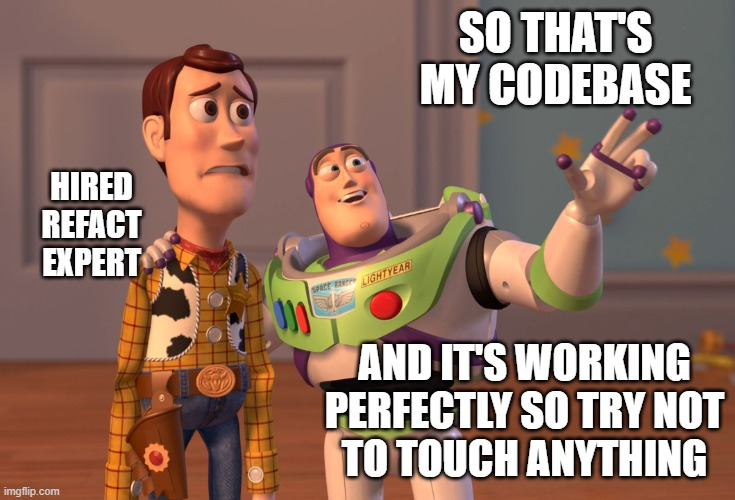

## Legacy Code - Meme

 \
Quelle: <https://www.monkeyuser.com/2020/project-setup/>

This test is to show how works or looks git diff :) \

and here some text for mergin sample git branch into master on my git account :)

 \
Quelle: <https://imgflip.com/i/4uyzqe>

## Legacy system
In computing, a legacy system is an old method, technology, computer system, or application program, "of, relating to, or being a previous or outdated computer system," yet still in use. Often referencing a system as "legacy" means that it paved the way for the standards that would follow it. This can also imply that the system is out of date or in need of replacement.
Quelle: <https://en.wikipedia.org/wiki/Legacy_system>
