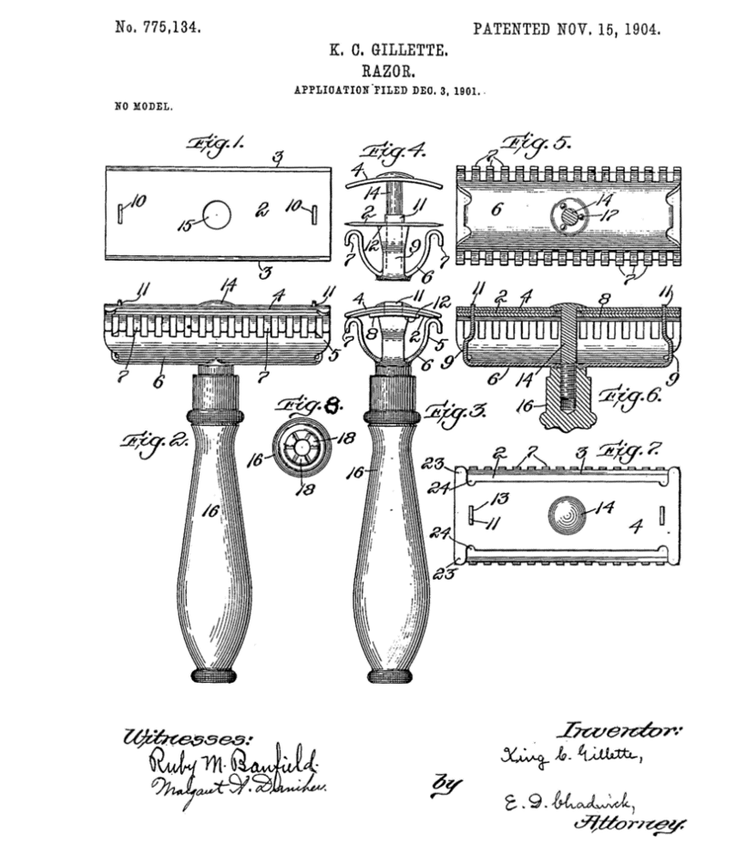
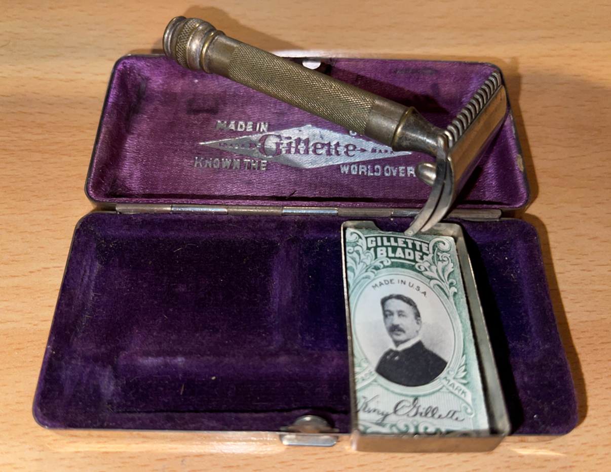
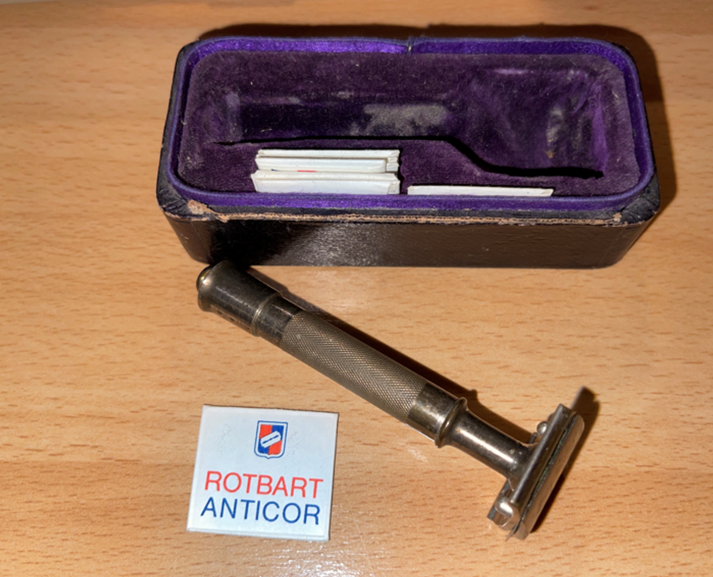

# Verrückte Leidenschaft - 
Gillettes Rasierapparat-Patent vom 15. Nov. 1904 1901 entwickelte King Camp Gillette zusammen 
mit William Nickerson den Sicherheitsrasierer mit einer dünnen, doppelseitigen Klinge aus Bandstahl.

Bereits 1904 konnte die in Boston ansässige Gillette Company 90.000 Hobel und 10.000 Ersatzklingenpäckchen absetzen. 
Durch die Einführung der austauschbaren Klinge wurde ein großer Markt für den Verkauf von Rasierklingen geschaffen. 
Andere Hersteller brachten deshalb bald Rasiergeräte auf den Markt, die dem Gillettestandard entsprachen.

In Deutschland machte sich zunächst eine Vielzahl von Kleinherstellern daran, den Bedarf an Rasierhobeln durch 
Gillettekopien oder einfache und ungemarkte Hobel zu decken. Nach dem Ersten Weltkrieg stieg die Berliner 
Roth Büchner GmbH mit ihrer Marke Rotbart zum größten deutschen Hersteller auf und wurde bis 1931 von Gillette 
übernommen.

