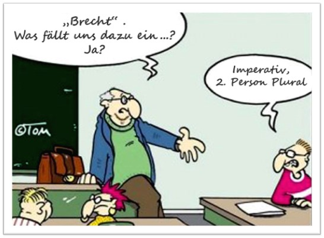
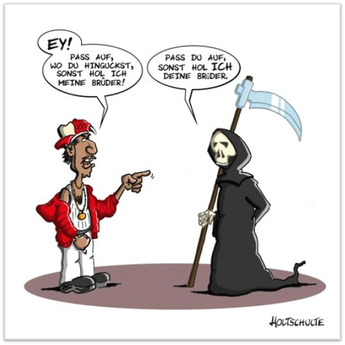

**Was ist Schlagfertigkeit?**

- Kreatives Spiel mit Sprache
- „pragmatische Legitimation“ und „ästhetische Legitimation“:
•	Pragmatisch: Reaktion der Situation angemessen und verständlich, 
•	Ästhetisch: möglichst gut rhetorisch verpackt sein sollte
- Machtspiel/ verbale Überlegenheit

**Warum ist es wichtig, schlagfertig zu sein?**

- wer es ist, wird respektiert und gehört
- Ist sie nicht eher ein angeborenes Talent, mit dem einige Menschen gesegnet sind und andere nicht? Nicht unbedingt, denn: viele unserer sprachlichen Handlungen sind rituell, man kann trainieren, auf wiederkehrende Situationen zu reagieren

**Kritische Situationen**

- Dumme Sprüche, Beleidigungen, Provokationen

- Bloßstellung

- Wutausbrüche des anderen

- Ungeschicktheit/ Taktlosigkeit

- Jemand reagiert belehrend, herablassend, gereizt oder amüsiert

  <u>Ziel:</u> sich behaupten, ohne unnötig verletzend zu werden 

**Die innere Blockade überwinden**

Bei innerer Blockade / „Schockstarre“:

*Mental:*

- Vergangene Situationen visualisieren, in denen man ruhig geblieben ist

- Sich das Schutzschild konkret vorstellen

- Mantra verwenden, um Schutzschild zu aktivieren, wie z.B. „Das trifft mich nicht“

- Üben, diesen Schutzschild ein- und auszuschalten

*Körperlich:*

- tief durchzuatmen und sich Raum schaffen

- fester, nicht zu breitbeinigen Stand

- Blickkontakt halten

- selbstbewusstes Auftreten, Mimik und Haltung

**Schlagfertigkeitstechniken**

<u>Bei Wutausbrüchen:</u>

- Beleidigungen ignorieren
- Den Spiegel vorhalten
   „Sie sind erregt.“ / „Sie schreien.“
- Die Situation verlassen
- Keine Rechtfertigungen (wenn man nicht schuldig ist)
- Nicht mit gleichen Mitteln reagieren

<u>Bei dummen Sprüchen, Provokationen und Abwertungen:</u>

1. „Absurdes Thearer“
- „Wie heißt es so schön, Tobias? Keiner kann durch die Nase eines anderen einatmen.“
- „Mit einer Hand kann man nicht klatschen.“ (chinesisch)
- „Der Neid brütet Schwäne aus faulen Enteneiern.“ (russisch)
- „Wenn Mandarinen dicke Schalen haben, muss man selber lange Fingernägel haben.“ (orientalisch)
2. Unerwartete /übertriebene Zustimmung
- „Sie sehen aber noch gut aus – sind Sie schon geliftet?“ 
	  Reaktion: „Gut geworden, nicht?“
	- „Sie sind doch nur ein Ossi!“
	  Reaktion: „Stimmt, haben Sie vielleicht ein Foto von einer Banane dabei?“
3. Dolmetscher-Technik
   - „Mältzer, Sie sind nicht teamfähig“, bemerkt der Vertriebsleiter. Mältzer entgegnet: „Ja, es gelingt mir durchaus, anspruchsvolle Aufgaben selbstständig und eigenverantwortlich zu lösen.“ 
     „Wenn XY ... dies und jenes ... bedeutet, ja, dann trifft XY zu.“
     Bsp.: „Wenn Streber bedeutet, dass ich Spaß daran habe, zu verstehen was in so einem Computer abläuft, oder wenn ich stundenlang davor sitze und damit spiele und das so richtig genieße, ja dann bin ich ein Streber.“

<u>Bei Abwertungen und Vorwürfen:</u>

1. Kategorisches Zurückweisen

  - „Das sehen Sie so, aber objektiv gesehen bin ich im Recht.“

2. Fokus-Rückfragen

  - „Sie leben ja ganz schön beengt hier.“
    –  „Wie haben Sie eigentlich Ihre Wohnung gefunden?“

  - „Warum sind Sie nur so borniert?“ 

    – „Was verstehen Sie denn unter borniert?“

    – „Woher wissen Sie das?"

3. Meta-Diskussion

   - Die Art des Angriffs beschreiben und negativ bewerten
     „Würden Sie bitte sachlich bleiben, wie alle anderen?“
   - Den Angreifer als Schuldigen für eine uneffektive Sitzung isolieren
     „Mit dieser Art verhindern Sie, dass wir hier weiterkommen.“
   - Ablenken
     „Und übrigens, wo stehen Sie mit ihrem Projekt XP13?“

<u>Der Gegenkonter</u>

- formaler Aufbau gleicht dem des Angriffs (Echo-Prinzip)
- trotz formaler Ähnlichkeit wird inhaltlich etwas Neues hinzugefügt, so dass eine neue, überraschende Aussage daraus resultiert
- Erwartungen werden durchbrochen
- Aussagen werden in ihr Gegenteil verkehrt

<u>Instant-Sätze</u>

- „Versuchen Sie jetzt doch bitte einmal einen intelligenten Kommentar!“
- „Meinen Sie das strategisch oder prophylaktisch?“ 
- „Sie hätten mich mal gestern erleben sollen.“
- „Sie sind ein guter Beobachter.“
- „Weißt du, du bist halt mein Vorbild.“
- „Dann passen wir ja gut zusammen.“
- „Na klar, merkt man das nicht?“

**Schlusswort**
„Schlagfertigkeit ist keine kommunikative Axt, die Wunden schlagen soll, sondern ein Ball, der aufgenommen wird, um mit ihm einige Augenblicke zu spielen und ihn dann ins Spiel zurückzugeben.“