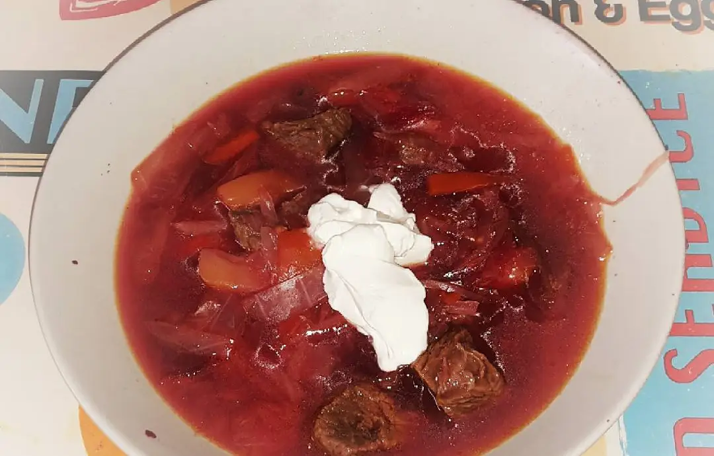

# борщ – Borscht

I’ve been never into beets and as child it was horrible to see it at lunchtime in school. Nearly twenty years passed and beets are still not my first choice but thanks to my mother-in-law I found a really tasty recipe which made beets a little less horrible.

- 4 liter water
- 1 kg beef incl. marrowbone
- 1 large beet
- 2 carrots
- 1 large onion
- 3 medium sized potatoes
- 1 small pepper
- 3 tomatoes
- ¼ cabbage (shredded)
- 2 cloves of garlic
- ½ lemon
- 4 bay leaves
- 6 peppercorns or allspice
- sunflower oil
- sour cream
	

Find a big pot (5 liter should fit into – better more) and heat the water. It should not boil. During this time, peel the beetroot. Add the meat and bring to a gentle boil. Reduce to medium heat so the stock can simmer. Remove the foam on the surface. Now you should add some salt (to taste) and the peeled beetroot – simmer everything for one hour.

In the meantime, peel the potatoes and cut them into small pieces (cold water keeps them fresh). Cut the carrots into thin strips and the onion, peppers and tomatoes into quarters and slice each.
Heat the oil in a pan. First, fry the onion (briefly) and add peppers, carrots and tomatoes. Season it with a little salt and pepper and fry (covered), until the vegetables are simmering in its own juice. Always stir! Now you cut the cabbage quarter into finger-long slices. If an hour of cooking time passed, you should add the roasted vegetables from the pan, potatoes, cabbage, bay leaves and pepper (allspice) grains to the soup pot. This is allowed to simmer covered for another hour.
After this, take the beetroot out and rub them small on a large grater and add the grated or crushed garlic. The lemon half should be pressed from above the beetroot and this can be briefly stand on a plate. Then you take the meat out, separating it from the bones and cut it into small pieces. Then make up everything (beetroot, garlic, lemon juice and meat) back into the soup pot and stir it well. One can taste again and optionally seasoning with salt and pepper. Turn off the stove and serve it with sour cream (though it tastes even more delicious on the second day).

recipe is from http://sometimeschef.com/2015/11/19/%d0%b1%d0%be%d1%80%d1%89-borscht/ (Denis Renning)

(this line is added just for diff showcase)
